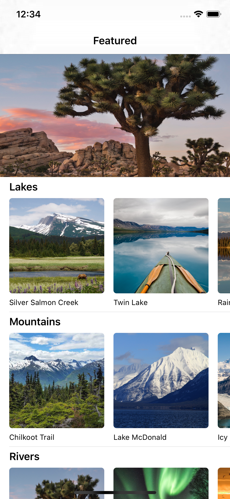
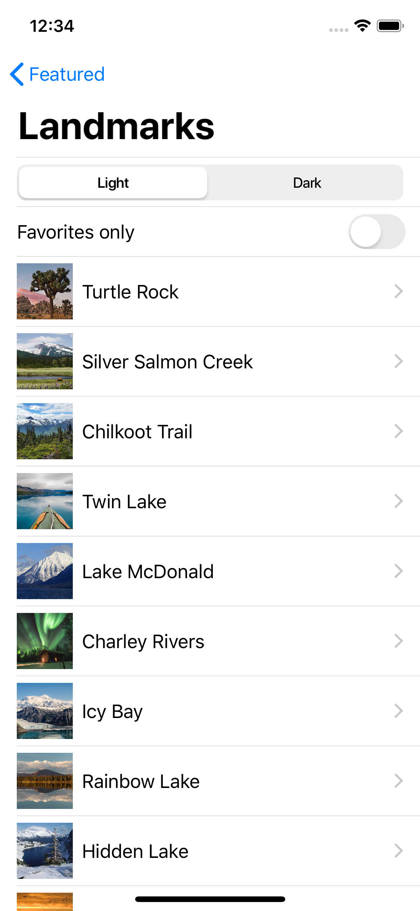
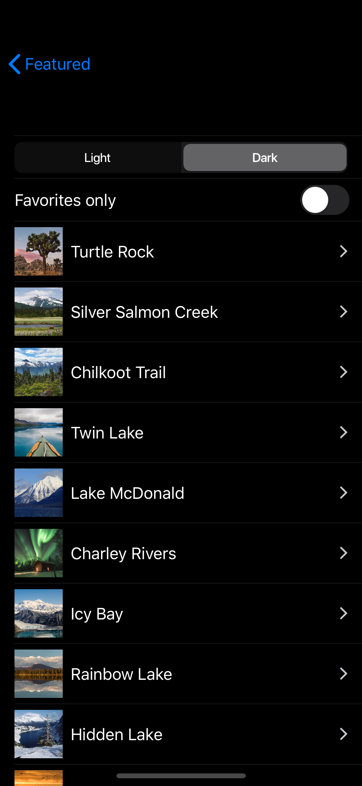
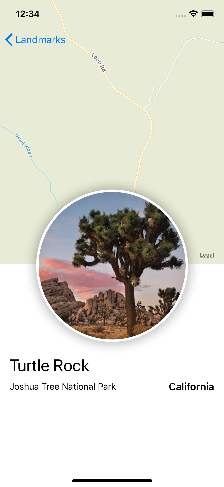

# SwiftUIExample (WIP)

This Repository was re-implemented for personal study of `MVVM`, `EnvironmentObject`, `ObjectBinding`,  `BindableObject` , `Combine`, `propertyWrapper` , based on Apple's official [SwiftUI Tutorial](https://developer.apple.com/tutorials/swiftui).

Please check [Wiki](https://github.com/LeeGwangYong/SwiftUIExample/wiki) for details.

이 Repository는 Apple의 공식 문서인 [SwiftUI 튜토리얼](https://developer.apple.com/tutorials/swiftui) 을 기반하여,  `MVVM`, `EnvironmentObject`, `ObjectBinding`,  `BindableObject` , `Combine`, `propertyWrapper` 등에 대한 개인 공부를 목적으로 재구현되었습니다.

자세한 사항은 [Wiki](https://github.com/LeeGwangYong/SwiftUIExample/wiki) 를 확인해주세요.

Always welcome PR and Isue.

PR과 Issue는 항상 환영합니다.

  
  
  
   

